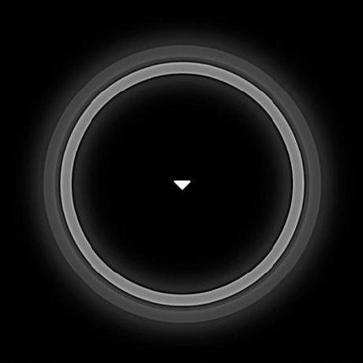
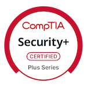
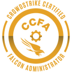

| Kscript.me | Yin | Yang |
|:---:|:---:|:---:|
|  | _Is the state of darkness — the moment of collapse, entropy, and dissolution. It is when systems, cycles, or states break down and return to their raw, unformed potential.._  _[Atlas](https://kscript.me/atlas) . [Aurora](https://kscript.me/aurora) . [Fauno](https://kscript.me/fauno) . [Hero](https://kscript.me/hero) . [Texugo](https://kscript.me/texugo) . [Vilgax](https://kscript.me/vilgax)_ | _Is the purification of that previous state — the force that takes what dissolved and reshapes it into something new, clearer, and more refined than before._  _[Atlas](https://atlas.kscript.me) . [Aurora](https://aurora.kscript.me) . [Fauno](https://fauno.kscript.me) . [Hero](https://hero.kscript.me) . [Texugo](https://texugo.kscript.me) . [Vilgax](https://vilgax.kscript.me)_ |

-------------------------

| About | Skills | Certifications |
|:---:|:---:|:---:|
| _Security Engineer & Automation Specialist with 5+ years of experience building and operating enterprise cybersecurity environments. Specialist in CrowdStrike (CCFA), EDR, IDP, SIEM, SOAR, PAM, and Vulnerability Management._  _I design architectures and automation pipelines that eliminate manual work and accelerate incident response. My background in Data Science and software development enables me to turn security signals into intelligent workflows and fast, data-driven decisions for Blue Team, Red Team, and SOC operations._ | _`CrowdStrike Falcon (EDR)` - `Security Automation` - `SIEM/SOAR` - `Vulnerability Management` - `Incident Response`_ |   |

-------------------------

| Featured Projects | What it delivers | Repository |
|:---:|:---:|:---:|
| _`Crowdstrike Detection Cmdline History`_ | _SOAR workflow that auto-emails a compromised host's command-line history on every High/Critical or OverWatch detection, with full process lineage._ | [_Link_](https://github.com/jkienen/Crowdstrike-Detection-Cmdline-History) |
| _`Crowdstrike Prevention Health Sensor`_ | _Fleet-wide sensor health audit built on Zero Trust Assessment, surfacing RFM and degraded protections in a per-OS OK/ATTENTION report._ | [_Link_](https://github.com/jkienen/Crowdstrike-Prevention-Health-Sensor) |
| _`Crowdstrike USB Device Control Usage`_ | _Audits the Device Control USB allowlist against real usage, flagging each exception as active or dormant so stale ones can be safely revoked._ | [_Link_](https://github.com/jkienen/Crowdstrike-USB-Device-Control-Usage) |
| _`Crowdstrike Wazuh Integration`_ | _Ingests CrowdStrike Falcon alerts into Wazuh every 5 minutes, classified by product (IDP, EDR, XDR) and severity. No SIEM connector required._ | [_Link_](https://github.com/jkienen/Crowdstrike-Wazuh-Integration) |
| _`Full Stack Task Manager`_ | _Full-stack task manager (FastAPI + SQLite + Next.js), fully containerized with Docker Compose and covered by automated API tests._ | [_Link_](https://github.com/jkienen/Challenge-TaskManager) |

<table>
<tr>
<th align="center" width="50%">Yin</th>
<th align="center" width="50%">Yang</th>
</tr>
<tr>
<td align="center">

_Is the state of darkness — the moment of collapse, entropy, and dissolution. It is when systems, cycles, or states break down and return to their raw, unformed potential._

_[Atlas](https://kscript.me/atlas) . [Aurora](https://kscript.me/aurora) . [Fauno](https://kscript.me/fauno) . [Hero](https://kscript.me/hero) . [Texugo](https://kscript.me/texugo) . [Vilgax](https://kscript.me/vilgax)_

</td>
<td align="center">

_Is the purification of that previous state — the force that takes what dissolved and reshapes it into something new, clearer, and more refined than before._

_[Atlas](https://atlas.kscript.me) . [Aurora](https://aurora.kscript.me) . [Fauno](https://fauno.kscript.me) . [Hero](https://hero.kscript.me) . [Texugo](https://texugo.kscript.me) . [Vilgax](https://vilgax.kscript.me)_

</td>
</tr>
</table>

-------------------------

### About

_Security Engineer & Automation Specialist with 5+ years of experience building and operating enterprise cybersecurity environments. Specialist in CrowdStrike (CCFA), EDR, IDP, SIEM, SOAR, PAM, and Vulnerability Management._

_I design architectures and automation pipelines that eliminate manual work and accelerate incident response. My background in Data Science and software development enables me to turn security signals into intelligent workflows and fast, data-driven decisions for Blue Team, Red Team, and SOC operations._

### Skills

`CrowdStrike Falcon (EDR)` · `Security Automation` · `SIEM/SOAR` · `Vulnerability Management` · `Incident Response`

### Certifications

 &nbsp; 

-------------------------

### Featured Projects

| Project | What it delivers |
|:---|:---|
| [_**Crowdstrike Detection Cmdline History**_](https://github.com/jkienen/Crowdstrike-Detection-Cmdline-History) | _SOAR workflow that auto-emails a compromised host's command-line history on every High/Critical or OverWatch detection, with full process lineage._ |
| [_**Crowdstrike Prevention Health Sensor**_](https://github.com/jkienen/Crowdstrike-Prevention-Health-Sensor) | _Fleet-wide sensor health audit built on Zero Trust Assessment, surfacing RFM and degraded protections in a per-OS OK/ATTENTION report._ |
| [_**Crowdstrike USB Device Control Usage**_](https://github.com/jkienen/Crowdstrike-USB-Device-Control-Usage) | _Audits the Device Control USB allowlist against real usage, flagging each exception as active or dormant so stale ones can be safely revoked._ |
| [_**Crowdstrike Wazuh Integration**_](https://github.com/jkienen/Crowdstrike-Wazuh-Integration) | _Ingests CrowdStrike Falcon alerts into Wazuh every 5 minutes, classified by product (IDP, EDR, XDR) and severity. No SIEM connector required._ |
| [_**Full Stack Task Manager**_](https://github.com/jkienen/Challenge-TaskManager) | _Full-stack task manager (FastAPI + SQLite + Next.js), fully containerized with Docker Compose and covered by automated API tests._ |

| Kscript.me | Yin | Yang |
|:---:|:---:|:---:|
|  | _Is the state of darkness — the moment of collapse, entropy, and dissolution. It is when systems, cycles, or states break down and return to their raw, unformed potential.._  _[Atlas](https://kscript.me/atlas) . [Aurora](https://kscript.me/aurora) . [Fauno](https://kscript.me/fauno) . [Hero](https://kscript.me/hero) . [Texugo](https://kscript.me/texugo) . [Vilgax](https://kscript.me/vilgax)_ | _Is the purification of that previous state — the force that takes what dissolved and reshapes it into something new, clearer, and more refined than before._  _[Atlas](https://atlas.kscript.me) . [Aurora](https://aurora.kscript.me) . [Fauno](https://fauno.kscript.me) . [Hero](https://hero.kscript.me) . [Texugo](https://texugo.kscript.me) . [Vilgax](https://vilgax.kscript.me)_ |

-------------------------

| About | Skills | Certifications |
|:---:|:---:|:---:|
| _Security Engineer & Automation Specialist with 5+ years of experience building and operating enterprise cybersecurity environments. Specialist in CrowdStrike (CCFA), EDR, IDP, SIEM, SOAR, PAM, and Vulnerability Management._  _I design architectures and automation pipelines that eliminate manual work and accelerate incident response. My background in Data Science and software development enables me to turn security signals into intelligent workflows and fast, data-driven decisions for Blue Team, Red Team, and SOC operations._ | _`CrowdStrike Falcon (EDR)` - `Security Automation` - `SIEM/SOAR` - `Vulnerability Management` - `Incident Response`_ |   |

-------------------------

| Featured Projects | What it delivers | Repository |
|:---:|:---:|:---:|
| _`Crowdstrike Detection Cmdline History`_ | _SOAR workflow that auto-emails a compromised host's command-line history on every High/Critical or OverWatch detection, with full process lineage._ | [_`Link`_](https://github.com/jkienen/Crowdstrike-Detection-Cmdline-History) |
| _`Crowdstrike Prevention Health Sensor`_ | _Fleet-wide sensor health audit built on Zero Trust Assessment, surfacing RFM and degraded protections in a per-OS OK/ATTENTION report._ |
| _`Crowdstrike USB Device Control Usage`_ | _Audits the Device Control USB allowlist against real usage, flagging each exception as active or dormant so stale ones can be safely revoked._ |
| _`Crowdstrike Wazuh Integration`_ | _Ingests CrowdStrike Falcon alerts into Wazuh every 5 minutes, classified by product (IDP, EDR, XDR) and severity. No SIEM connector required._ |
| _`Full Stack Task Manager`_ | _Full-stack task manager (FastAPI + SQLite + Next.js), fully containerized with Docker Compose and covered by automated API tests._ |
