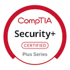
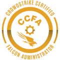
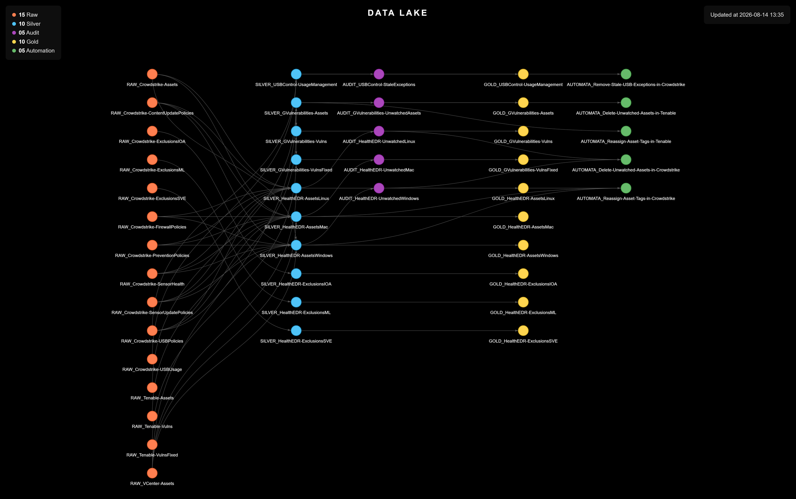

<table>
<tr><td align="center">

</td></tr>
</table>

| Yin | Yang |
|:---:|:---:|
| _Is the state of darkness — the moment of collapse and dissolution. It is when cycles, or states break down and return to their raw, unformed potential._  _[Atlas](https://kscript.me/atlas) . [Aurora](https://kscript.me/aurora) . [Fauno](https://kscript.me/fauno) . [Hero](https://kscript.me/hero) . [Texugo](https://kscript.me/texugo) . [Vilgax](https://kscript.me/vilgax)_ | _Is the purification of that previous state — the force that takes what dissolved and reshapes it into something new, clearer, and more refined than before._  _[Atlas](https://atlas.kscript.me) . [Aurora](https://aurora.kscript.me) . [Fauno](https://fauno.kscript.me) . [Hero](https://hero.kscript.me) . [Texugo](https://texugo.kscript.me) . [Vilgax](https://vilgax.kscript.me)_ |

-------------------------

<table>
<tr><td align="center">

**About**

_Security Engineer & Automation Specialist with 5+ years of experience building and operating enterprise cybersecurity environments. Specialist in CrowdStrike (CCFA), EDR, IDP, SIEM, SOAR, PAM, and Vulnerability Management._

_I design architectures and automation pipelines that eliminate manual work and accelerate incident response. My background in Data Science and software development enables me to turn security signals into intelligent workflows and fast, data-driven decisions for Blue Team, Red Team, and SOC operations._

 &nbsp; 

`CrowdStrike Falcon (EDR)` · `Security Automation` · `SIEM/SOAR` · `Incident Response` · `Vulnerability Management` 

</td></tr>
</table>

-------------------------

<table width="100%">

**Featured Project**

<tr><td align="center">

  

Every automation in production is a decision made on someone's behalf, and when one deletes or closes a record, the only proof it existed goes with it.

This catalog makes the whole chain visible. An AI skill reads each project's code and writes one YAML file per endpoint, rule, audit, indicator and automation. 

It ships with **15+ endpoints** documented as working samples of real automations across CrowdStrike, Tenable and VCenter, and **30+ Gold indicators** built on top of them to track monthly, plus an **Audit layer** that keeps the record of what was acted on after the action erased it at the source.

**Living documentation, written and standardized by AI — every KPI auditable down to the code that produced it, at any moment, with no human upkeep.**

**[Explore this catalog ->](https://github.com/jkienen/Catalog-DataLake_v1)**

</td></tr>
</table>

-------------------------

| Ready-to-Run Projects | What it delivers |
|:---:|:---:|
| [_`Crowdstrike Batch Execution`_](https://github.com/jkienen/CS-Batch-Execution) | _<mark>`Fleet-wide answers in seconds + audit-ready evidence`</mark> run any custom command across every server in a single RTR batch session, exported as CSV, in minutes instead of hours._ |
| [_`Crowdstrike Detection Cmdline History`_](https://github.com/jkienen/CS-Detection-Cmdline-History) | _<mark>`Analyst time back + faster triage decisions`</mark> command-line history and full process lineage land in the responder's inbox on detection, cutting first-response triage time by 30+ minutes._ |
| [_`Crowdstrike Prevention Health Sensor`_](https://github.com/jkienen/CS-Prevention-Health-Sensor) | _<mark>`EDR health-check freeing ~24 analyst-hours per week`</mark> fleet-wide sensor-health audit built on Zero Trust Assessment, surfacing RFM and degraded protections in a per-OS OK/ATTENTION report._ |
| [_`Crowdstrike USB Device Control Usage`_](https://github.com/jkienen/CS-Device-Control-Usage) | _<mark>`Defensible least-privilege, backed by evidence`</mark> audits the Device Control USB allowlist against real usage, flagging each exception as active or dormant so stale ones can be safely revoked._ |
| [_`Crowdstrike Wazuh Integration`_](https://github.com/jkienen/CS-Wazuh-Integration) | _<mark>`Falcon telemetry in your SIEM + zero connector spend`</mark> ingests CrowdStrike Falcon alerts into Wazuh every 5 minutes, classified by product (IDP, EDR, XDR) and severity, with no SIEM connector required._ |
| [_`Data Lake Layers Template`_](https://github.com/jkienen/Catalog-DataLake_v0) | _<mark>`Trustworthy data foundation for security KPIs & automation`</mark> organizes a Data Lake's processing layers (Raw → Silver → Gold) and the indicators and automations generated from them._ |
| [_`Full Stack Task Manager`_](https://github.com/jkienen/Challenge-TaskManager) | _<mark>`Production-grade delivery, end to end`</mark> full-stack task manager (FastAPI + SQLite + Next.js), fully containerized with Docker Compose and covered by automated API tests._ |
